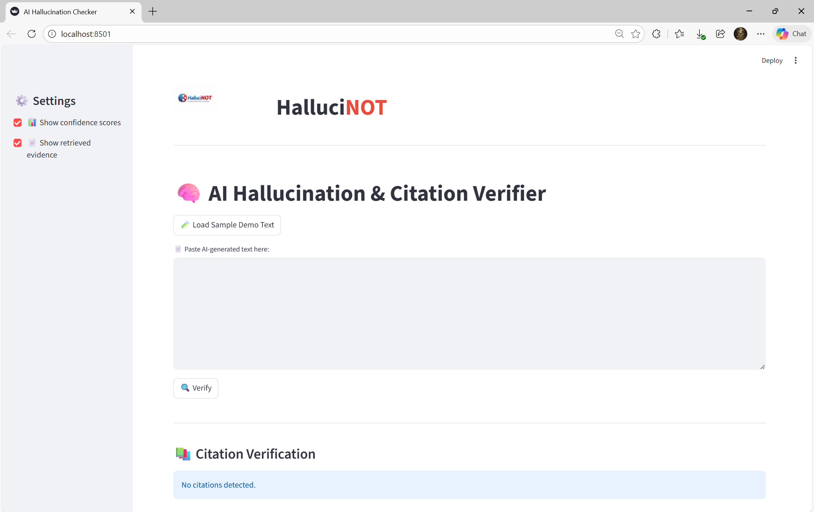
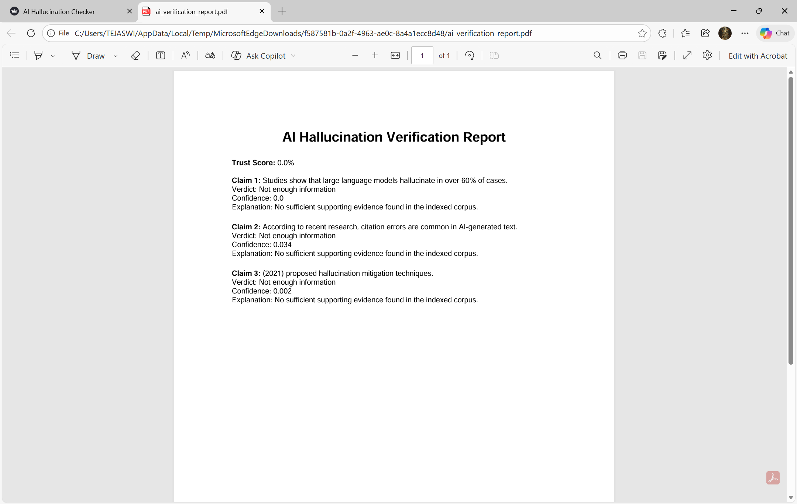

# GFGBQ-Team-twobytes
Repository for twobytes - Vibe Coding Hackathon
# Problem Statement
PS 03: AI Hallucination and Citation Verification System

Generative AI models are widely used for research, learning, and decision making. However, these models often generate factually incorrect information presented with high confidence. A critical extension of this problem is the creation of fake citations, non-existent references, and broken links, which appear legitimate but cannot be verified. This makes it difficult for users to trust AI-generated content and may lead to misinformation, legal risks, and ethical concerns.

Build a system that can detect, flag, and verify factual claims and citations generated by AI models, helping users distinguish between reliable and unreliable AI-produced information.


---

## 2️⃣ Project Name

**HalluciNOT – AI Hallucination & Citation Verifier**

---

## 3️⃣ Team Name

**Team twobytes**

---

## 4️⃣ Deployed Link (optional)

🔗 *Not deployed (local Streamlit application)*
*(Can be updated if deployed later)*

---

## 5️⃣ 2-Minute Demonstration Video Link

🎥 *[Add your Google Drive / YouTube link here]*

---

## 6️⃣ PPT Link

📊https://docs.google.com/presentation/d/17D-ImgNdI-QYHA3a9GS-ZrHZ1vcdcor4/edit?usp=sharing&ouid=106658113168494542941&rtpof=true&sd=true

---

---

# 📄 Project Overview

**HalluciNOT** is an AI-powered system that detects hallucinations in AI-generated text by:

* Extracting factual claims
* Retrieving real-world evidence from indexed datasets (Wikipedia + internal corpus)
* Verifying claims using Natural Language Inference (BART-MNLI)
* Detecting fake or unverifiable citations
* Computing a transparent **Trust Score**
* Generating downloadable **JSON & PDF verification reports**

The goal is to **increase trust, accountability, and explainability** in AI-generated content.

---

# 🧠 System Architecture

**Pipeline Flow:**

```
AI Text Input
   ↓
Claim Extraction
   ↓
Evidence Retrieval (FAISS + Wikipedia)
   ↓
Claim Verification (MNLI)
   ↓
Trust Score Computation
   ↓
Evidence-backed Verdict + Reports
```

---

# 🛠️ Tech Stack

* **Python**
* **Streamlit** – Interactive UI
* **SentenceTransformers** – Semantic embeddings
* **FAISS** – Vector similarity search
* **BART-Large-MNLI** – Claim verification
* **Wikipedia Dataset** – Real-world grounding
* **ReportLab** – PDF report generation

---

# ⚙️ Setup & Installation Instructions

### 1️⃣ Clone the Repository

```bash
git clone https://github.com/ByteQuest-2025/GFGBQ-Team-twobytes.git
cd GFGBQ-Team-twobytes
```

---

### 2️⃣ Create Virtual Environment

```bash
python -m venv venv
venv\Scripts\activate   # Windows
# OR
source venv/bin/activate  # Linux/Mac
```

---

### 3️⃣ Install Dependencies

```bash
pip install -r requirements.txt
```

---

### 4️⃣ Build Evidence Index (Required Once)

```bash
python build_index.py
```

This step:

* Ingests internal + Wikipedia data
* Creates FAISS vector index

---

# ▶️ Usage Instructions

### Run the Application

```bash
streamlit run app.py
```

### How to Use:

1. Paste AI-generated text
2. (Optional) Load demo sample
3. Click **Verify**
4. View:

   * Claim-wise verdicts
   * Evidence sources
   * Confidence scores
   * Trust Score summary
5. Download:

   * JSON verification report
   * PDF verification report

---

# 📊 Trust Score Explanation

```
Trust Score = (Supported Claims / Total Claims) × 100
```

Color-coded interpretation:

* 🟢 **High Trust** (≥ 70%)
* 🟡 **Moderate Trust** (40–69%)
* 🔴 **Low Trust** (< 40%)

---

# 🧪 Key Features

✅ Claim-level verification
✅ Wikipedia-backed evidence retrieval
✅ Numeric-claim safety checks
✅ Fake citation detection
✅ Transparent explanations
✅ PDF & JSON report export
✅ Clean, judge-friendly UI
✅ HalluciNOT branding & logo

---

## 📸 Relevant Screenshots

### 🏠 Home UI


### 📊 Trust Score Summary


### 📄 PDF Report


---


# 🏁 Conclusion

**HalluciNOT** addresses one of the most critical problems in modern AI — **hallucinated facts and fake citations** — by combining semantic retrieval, natural language inference, and transparent scoring into a single, user-friendly verification system.

